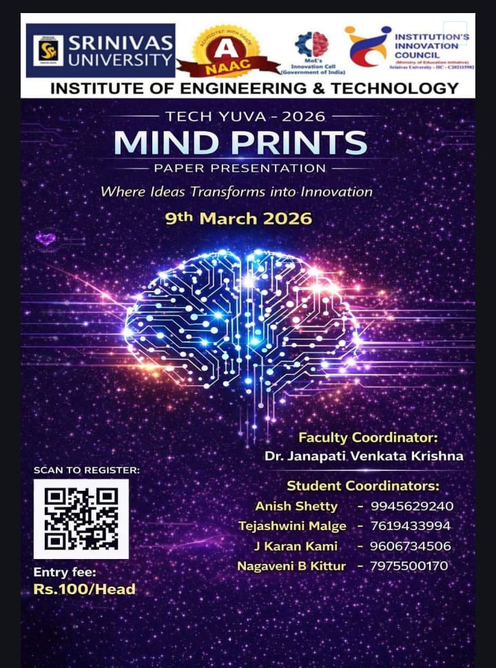
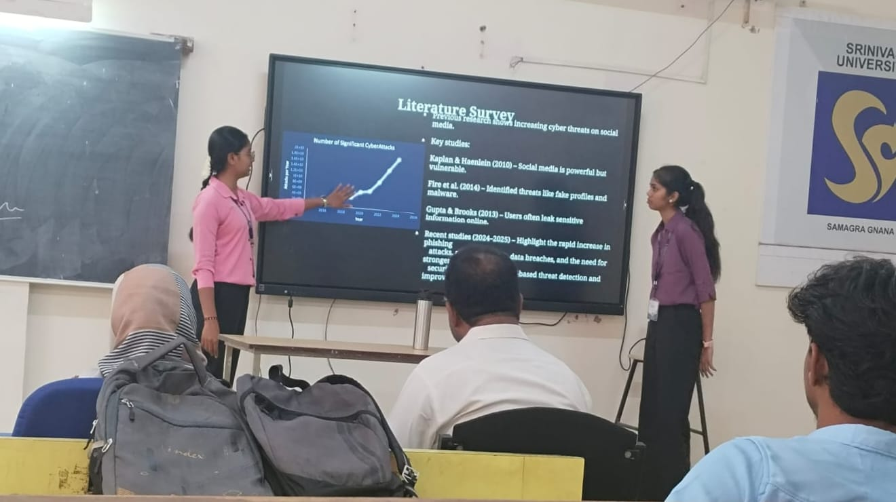
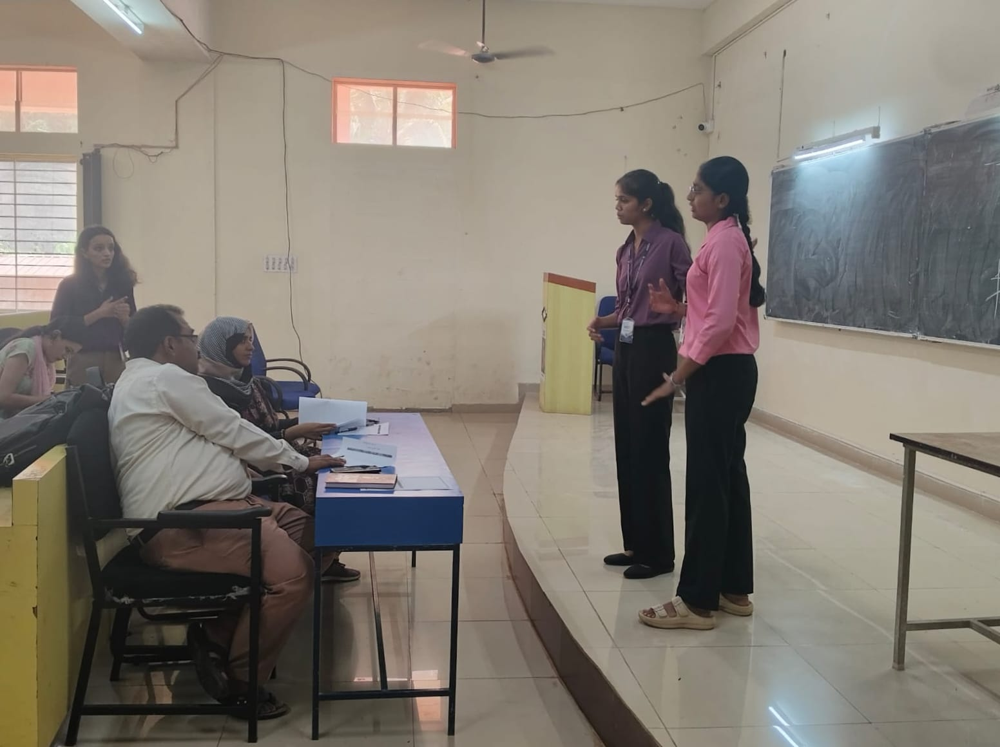

# MindPrints Cybersecurity Presentation

This repository contains a paper presentation and study on **Cybersecurity in Social Media Platforms**.  
The project analyzes major cybersecurity threats that occur on social media and explains methods to protect users and their data.

---

## 📌 Project Overview

Social media platforms such as **Facebook, Instagram, Twitter, and YouTube** are widely used for communication and information sharing. However, the rapid growth of these platforms has increased cybersecurity threats such as:

- Phishing attacks
- Identity theft
- Malware attacks
- Account hacking
- Data breaches
- Fake profiles

This project studies these threats and discusses possible security solutions to protect users.

---

## 🎯 Objectives

The main objectives of this project are:

- To analyze cybersecurity threats in social media platforms
- To study the impact of cyberattacks on users
- To identify security vulnerabilities in social media usage
- To explore cybersecurity techniques used to protect data
- To promote safe and responsible social media usage

---

## ⚠️ Common Cybersecurity Threats

### 1. Phishing Attacks
Fake messages or links that trick users into revealing passwords or personal information.

### 2. Malware Attacks
Malicious software that can steal data or damage user devices.

### 3. Identity Theft
Attackers steal personal information to create fake profiles or perform fraud.

### 4. Account Hijacking
Unauthorized access to a user's social media account.

### 5. Cyberbullying
Harassment or threats using online communication platforms.

---

## 🛡️ Security Solutions

Some important methods to improve cybersecurity include:

- Using **strong passwords**
- Enabling **Two-Factor Authentication (2FA)**
- Adjusting **privacy settings**
- Avoiding suspicious links
- Increasing **cybersecurity awareness**
- Using **AI-based security systems**

---

## 🏗️ System Architecture

The cybersecurity protection system involves:

1. User access through internet devices  
2. Authentication systems (passwords, 2FA, biometrics)  
3. Security technologies such as encryption and intrusion detection  
4. Threat monitoring and detection  
5. Blocking malicious activities and protecting user data  

---

## 📊 Results

The study shows that:

- Cyber threats on social media are increasing rapidly.
- Many users lack awareness about online security.
- Weak passwords and public data sharing increase risk.
- Security features like **2FA and privacy settings** significantly reduce cyber attacks.

---

## 📂 Project Files

- `PaperPresentation.pdf` – Research paper on Cybersecurity in Social Media  
- `PaperPresentation.pptx` – Presentation slides used for the seminar  

---
## 📢 Event Poster

## 📸 Presentation Photos

## 📚 References

- IEEE Computer Society – Cybersecurity and Privacy in the Digital Age  
- NIST Cybersecurity Framework  
- Statista Cybersecurity Reports  
- Journal of Big Data Research Papers  

---

## 👩‍💻 Authors

- **Tejashwini Havanur**  
- **Suhani**

Department of Computer Science and Engineering  
Srinivas University Institute of Engineering and Technology  
Mangalore, India

---

⭐ If you found this project useful, feel free to star the repository.
